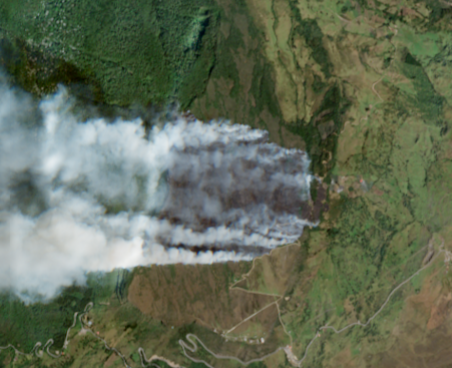
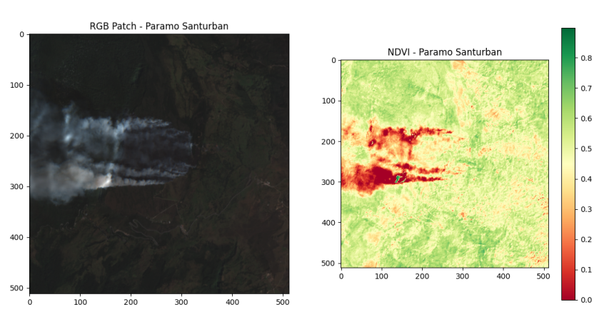
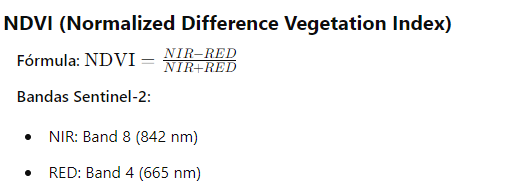
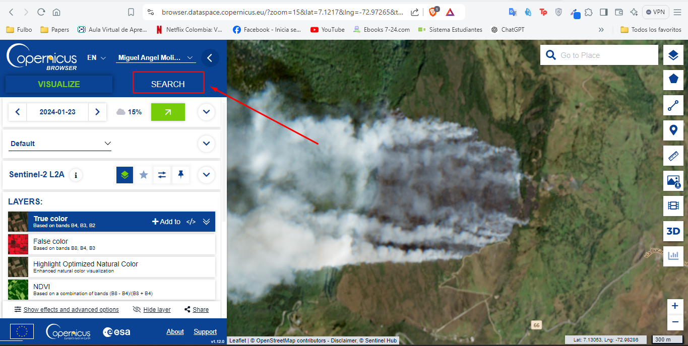

# 🔥 Análisis de Impacto Ambiental por Incendio - PRE y POST (23 de enero)

Este proyecto tiene como objetivo analizar el impacto ambiental causado por un incendio ocurrido el **23 de enero**, utilizando imágenes satelitales antes y después de la fecha, junto con índices de vegetación.




---

## 🌱 Objetivo

Evaluar la **afectación del terreno** mediante análisis multitemporal de imágenes Sentinel-2, usando índices de vegetación clave como NDVI, NBR, BAI y sus respectivas diferencias temporales (**delta NDVI / delta NBR**).



---

## 🛰️ Metodología

### 1. **Recolección de Imágenes**
- Se usan imágenes satelitales Sentinel-2 (MSIL2A) desde el portal de **Copernicus Data Space Browser**.
- Fechas de interés:

| Fecha        | Responsable |
|--------------|-------------|
| 16-nov-2023  | Michael     |
| 01-dic-2023  | Diego       |
| 15-ene-2024  | Andrés      |
| 18-ene-2024  | Gio         |
| **23-ene-2024** | **Michael** (Referencia) |
| 25-ene-2024  | Diego       |
| 28-ene-2024  | Andrés      |
| 12-feb-2024  | Gio         |
| 14-feb-2024  | Michael     |
| 29-feb-2024  | Diego       |
| 12-abr-2024  | Andrés      |
| 12-ago-2024  | Gio         |

---

### 2. **Índices de Vegetación Analizados**

- **NDVI** (Índice de Vegetación de Diferencia Normalizada)  
  Evalúa la salud de la vegetación; disminuye en áreas quemadas.
  
  


- **NBR** (Índice de Quemado Normalizado)  
  Ideal para identificar áreas afectadas por incendios y su severidad.

- **BAI** (Índice de Área Quemada)  
  Detecta superficies quemadas por su reflectancia característica.

- **ΔNDVI / ΔNBR**  
  Muestran la **diferencia entre fechas PRE y POST** incendio para cuantificar el impacto.


Nos enfocaremos unicamente en el NDVI para este estudio.
---

### 3. **Procesamiento y Scripts**

#### Paso a paso:
1. **Descarga de imágenes** desde Copernicus:
   👉 [Ir al portal](https://browser.dataspace.copernicus.eu/?zoom=14&lat=7.12044&lng=-72.96922&themeId=DEFAULT-THEME&visualizationUrl=U2FsdGVkX19wiGNdWzKSFC0HOrt3jPXVotu0dx0iHKQlhudZ6PANwZk4E83LeOS3TmFuWCn9Hhu1adYxwskiLb6ZmwFIS9falAyJJ11ijpWyfsqxDabgoyG3xKf70VIm&datasetId=S2_L2A_CDAS&fromTime=2024-01-23T00%3A00%3A00.000Z&toTime=2024-01-23T23%3A59%3A59.999Z)


     

2. **Descomprimir `.zip`** y ubicar carpeta `IMG_DATA`.

3. Ejecutar scripts en orden:

   - `Select_Patch.py`: Selección del parche RGB.
   - `cut.py`: Recorte de imagen RGB (bandas 4, 3, 2).
   - [Opcional] Upscale 2 veces usando alguna herramienta y/o IA.
   - `NDVI.py`: Cálculo y generación de imagen `NDVI_patch.png`.

> ⚠️ Todos deben usar **el mismo parche** de referencia (23-ene) para evitar desplazamientos en los GIFs.

---

## 🎞️ Visualización

- Se generarán **GIFs animados** para cada índice (NDVI, NBR, BAI, etc.) mostrando la evolución del área en:
  - 4 fechas PRE incendio
  - 8 fechas POST incendio

---

## 📂 Entregables

| Entregable       | Responsables         |
|------------------|----------------------|
| 🎤 Slides (8–12) | Michael y Diego      |
| 📌 Poster        | Gio y Andrés         |


## 🛠️ Repositorio de Scripts

> 📌 Asegúrate de tener los siguientes scripts organizados en tu proyecto:
```
project/
├── IMG_DATA/
│ ├── ... (archivos Sentinel)
├── Select_Patch.py
├── cut.py
├── NDVI.py

```

---

## 🧠 Recomendaciones Finales

- Revisa las resoluciones de las imágenes antes de iniciar cualquier análisis.
- Coordina con tu equipo para asegurar la **uniformidad del parche**.
- Si el parche se ve corrido, ajusta manualmente las coordenadas en los scripts (`2363`, `1223`), especificamente para este estudio.

---

¡A darle con toda! 💪🔥 Este proyecto es clave para entender el impacto ambiental y generar conciencia sobre la gestión de incendios forestales.


